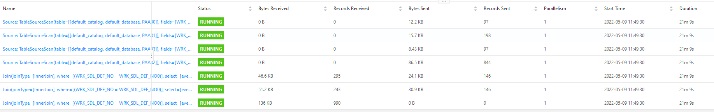
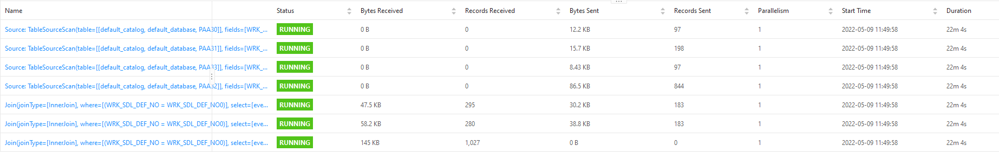
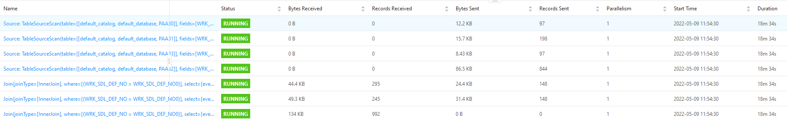

# Flink SQL Join Sample

in reference to https://stackoverflow.com/questions/72085961/inconsistent-results-when-joining-multiple-tables-in-flink/72086912

## Context 
In scope of the build of our application we need to sync data from a database (old application) to our (new) application. It's
crucial all data is synced correctly since both systems will run in parallel until the old one can be decommissioned. We enable 
CDC on our MsSQL database and register a Debezium source to put the CDC messages on a Pulsar topic. We then register our Flink 
job to listen to the topics using the StreamNative Flink-Pulsar connector. After processing the data, we write to another Pulsar 
topic, again using the StreamNative connector. 

## Issue Description
For this job we're joining data from multiple table, using the following query defined here: src/main/java/be/flink/sql/join/sample/database/Queries.java

```
"SELECT PAA30.WRK_SDL_DEF_NO as id,\n" +
"       PAA33.DSB_TX as description,\n" +
"       '1' as typeCode,\n" +
"       PAA30.PTY_NO as employerId,\n" +
"       PAA30.CPN_ORG_NO as companyOrganisationNumber,\n" +
"       PAA31.HTR_FROM_DT as historyFromDate,\n" +
"       PAA31.HTR_UNTL_DT as historyUntilDate,\n" +
"       PAA31.STT_DT as referenceStartDate,\n" +
"       PAA31.ATV_IC as active,\n" +
"       PAA31.HOUR_DY_QT as hoursPerDay,\n" +
"       PAA32.DY_NO as dayNumber,\n" +
"       PAA32.SEQ_NO as sequenceInDay,\n" +
"       PAA32.HOUR_QT as hourQuantity,\n" +
"       PAA32.PST_AST_CD as performanceCode,\n" +
"       PAA32.CTCR_CD as costCode,\n" +
"       PAA32.SHF_CD as shiftCode,\n" +
"       PAA30.REG_USER_CD as createdBy,\n" +
"       PAA30.REG_TS as createdTimeStamp,\n" +
"       PAA30.MUT_USER_CD as updatedBy,\n" +
"       PAA30.MUT_TS as updatedTimeStamp,\n" +
"       PAA30.event_time as cdcEventTime\n" +
"FROM PAA30\n" +
"INNER JOIN PAA31 ON PAA30.WRK_SDL_DEF_NO = PAA31.WRK_SDL_DEF_NO\n" +
"INNER JOIN PAA33 ON PAA30.WRK_SDL_DEF_NO = PAA33.WRK_SDL_DEF_NO AND PAA33.LGG_CD = 'NL'\n" +
"INNER JOIN PAA32 ON PAA30.WRK_SDL_DEF_NO = PAA32.WRK_SDL_DEF_NO";
```

When running this exact job a few times consecutive, we get mixed and inconsistent results. The expected result for the query
(running this query against the static database) is 1750 results. When running the query in the Flink job we get below results:

### Local Job Run Results

#### Run 1


#### Run 2


#### Run 3


this was the only correct result

#### Run 4


### Flink Instance Job Run Results

#### Run 1


Resulted in 1285 result messages on sink topic

#### Run 2


Resulted in 1629 result messages on sink topic

#### Run 3


Resulted in 1262 result messages on sink topic

#### Run 4


Resulted in 1298 result messages on sink topic

The amount of records sent from the sources is for all jobs the same, implying the sources do not cause the inconsistency of the data. 

## Implication
Because of these inconsistent results it's hard to trust the data will be correctly synced between the old and new application,
imposing a very high risk on the new application. 


